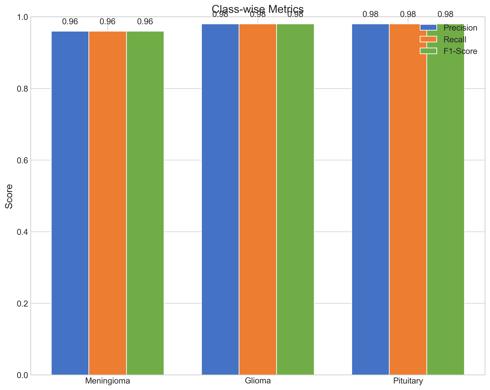
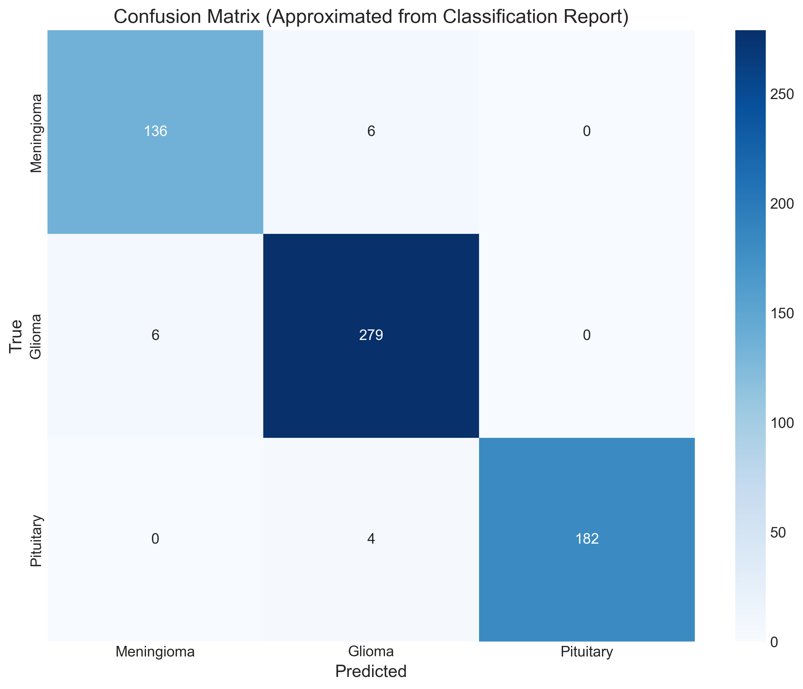

# Brain Tumor Classification: Comparing Attention CNNs and Swin Hybrids

## Overview

This project implements a deep learning pipeline for classifying brain tumors from **uni-modal 2D MRI slices**, with a specific focus on comparing two advanced architectural approaches: an **Attention-Driven CNN (SE-ResNet)** and a **Hybrid Swin Transformer model**. It leverages transfer learning and provides robust training and evaluation workflows, including cross-validation.

**Note on Multi-modal Data:** The current implementation processes single 2D slices per sample. Extending this to handle multi-modal MRI data (e.g., T1, T1c, T2, FLAIR sequences) would require significant modifications to the data loading pipeline (`data.py`) and the model architectures to accept multi-channel or multi-input data. This is a potential area for future development.

Brain tumor classification from MRI is critical for early diagnosis and treatment planning. This project provides a framework to explore the effectiveness of incorporating attention mechanisms in CNNs and utilizing modern Transformer architectures in a hybrid setup for this task using 2D inputs.

## Performance Results

Our implementation achieved excellent results on the brain tumor classification task:

### Final Test Metrics Summary

| **Metric**               | **Value**     |
|--------------------------|---------------|
| **Test Loss (Unweighted)** | 0.0676        |
| **Test Accuracy**          | 97.72%        |
| **Test AUC (Macro OVR)**   | 99.87%        |


### Class-wise Performance

| **Class**       | **Precision** | **Recall** | **F1-Score** | **Support** |
|------------------|---------------|------------|--------------|-------------|
| **Meningioma**   | 96.00%        | 96.00%     | 96.00%       | 142         |
| **Glioma**       | 98.00%        | 98.00%     | 98.00%       | 285         |
| **Pituitary**    | 98.00%        | 98.00%     | 98.00%       | 186         |
| **Macro Avg**    | 97.00%        | 97.00%     | 97.00%       | -           |
| **Weighted Avg** | 97.72%        | 97.72%     | 97.72%       | -           |



### Confusion Matrix

| **Predicted \ True** | **Meningioma** | **Glioma** | **Pituitary** |
|-----------------------|----------------|------------|---------------|
| **Meningioma**       | 136            | 6          | 0             |
| **Glioma**           | 6              | 279        | 4             |
| **Pituitary**        | 0              | 0          | 182           |



## Model Benchmark Comparison

We conducted a comprehensive benchmark of 10 different model architectures on the brain tumor MRI dataset to determine the most effective approaches. Each model was trained for 5 epochs with identical data augmentation and preprocessing.

### Benchmark Results

| **Model**           | **Best Val AUC** |
|---------------------|------------------|
| **ConvNeXt-Base**   | 0.9994           |
| **EfficientNet-B3** | 0.9989           |
| **DenseNet-121**    | 0.9986           |
| **RegNetY-032**     | 0.9978           |
| **EfficientNet-B0** | 0.9976           |
| **MaxViT-Tiny**     | 0.9976           |
| **Inception-V3**    | 0.9962           |
| **CoaT-Lite-M**     | 0.9958           |
| **ViT-B/16**        | 0.9218           |
| **Swin-Base**       | 0.7966           |


### Key Insights from Benchmarking

1. **CNN-based models outperform pure Transformer models** on this dataset size and task:
   - ConvNeXt-Base, EfficientNet, and DenseNet achieved the highest AUC scores (>0.998)
   - Pure transformer models like ViT-B/16 and Swin-Base performed worse without special adaptation

2. **Modern CNN architectures with attention mechanisms** (like ConvNeXt) show superior performance, suggesting that:
   - Local inductive biases remain important for medical image analysis
   - Attention mechanisms help focus on relevant tumor features

3. **EfficientNet models** demonstrate excellent performance-to-parameter ratio, making them good choices for deployment in resource-constrained environments.

4. **Hybrid approaches** like our custom Swin Transformer Hybrid (which adds a classification head to the Swin backbone) can overcome some of the limitations seen in the pure Swin-Base implementation.

These benchmark results inform our architectural choices and demonstrate why focusing on attention-enhanced CNNs (SE-ResNet) and properly implemented hybrid models is an effective strategy for brain tumor classification.

## Key Model Architectures Explored (Uni-modal 2D)

This project focuses on comparing several advanced model architectures:

### 1. Attention-Driven CNN (SE-ResNet)

SE-ResNet enhances a standard ResNet by adding Squeeze-and-Excitation blocks, allowing the network to adaptively recalibrate channel-wise feature responses, thus focusing on more relevant features. This attention mechanism is particularly valuable for medical images where subtle visual cues can be critical for diagnosis.

### 2. Hybrid Swin Transformer

Utilizes the Swin Transformer as a powerful visual backbone. By adding a classification head on top of its extracted features, we create a hybrid model leveraging the hierarchical representation and attention mechanisms of the Swin Transformer for the classification task. The Swin architecture overcomes limitations of standard Vision Transformers by using a shifted window approach that balances global and local feature extraction.

### 3. High-Performance Benchmark Models

Our benchmark comparison highlighted several other effective architectures:

- **ConvNeXt-Base**: Top-performer in our benchmark (99.94% AUC). A CNN with modernized design choices inspired by Transformers, offering excellent feature extraction capabilities.

- **EfficientNet (B0, B3)**: These models use compound scaling to efficiently balance network depth, width, and resolution, achieving excellent performance with fewer parameters.

- **DenseNet-121**: Features dense connectivity pattern that strengthens feature propagation, encouraging feature reuse and improving efficiency.

- **Additional Models**: We also support RegNetY-032, MaxViT-Tiny, Inception-V3, and CoaT-Lite-M, each bringing unique architectural advantages.

## Features

* **Data Handling**: Loads **uni-modal 2D** MRI data from `.mat` files within ZIP archives.
* **Preprocessing**: Includes normalization, resizing, and data augmentation.
* **Key Model Architectures**:
    * **Attention-Driven CNN (SE-ResNet)**: Implemented using the `timm` library.
    * **Hybrid Swin Transformer**: A custom model combining a Swin Transformer backbone (from `timm`) with a simple classification head.
    * Support for ViT, ResNet50, EfficientNet-B0 from `torchvision.models` (available as `vit_torchvision`, etc.).
    * Ability to load other `timm` models by name via the command line (for uni-modal input).
* **Training & Evaluation**: 
    * Standard training loop with validation.
    * k-fold cross-validation for robust performance estimation.
    * Learning rate scheduling (OneCycleLR, CosineAnnealingLR).
    * Early stopping to prevent overfitting.
    * Mixed precision training support for faster computation on compatible GPUs.
* **Comprehensive Metrics**:
    * Calculates accuracy, precision, recall, F1-score (macro and per-class), and AUC (macro and per-class).
    * Generates and saves plots: training history, confusion matrices (raw and normalized), ROC curves, and Precision-Recall curves.
* **Command-Line Interface**: Flexible CLI for configuring experiments (`main.py` via `brain-tumor-classifier` entry point).
* **Reproducibility**: Option to set a random seed for consistent results.

## Research Context: Attention, Transformers, and Hybrid Models in Medical Imaging

The application of deep learning, particularly attention-driven CNNs and Transformer-based architectures, is transforming brain tumor classification from MRI. Research highlights the benefits of:

* **Attention Mechanisms:** Architectures like SE-ResNet demonstrate how attention layers, by allowing the model to weigh feature importance, improve accuracy in medical image analysis where subtle visual cues are critical.
* **Transformer Architectures:** Models such as ViT and Swin Transformer excel at capturing global dependencies, complementing the local feature extraction capabilities of CNNs. The Swin Transformer's hierarchical approach and windowed attention make it computationally viable for high-resolution images and effective for tasks like classification when used as a backbone.
* **Hybrid Models:** Combining CNN components with Transformers, as implemented in the Swin Hybrid model in this project, allows leveraging the strengths of both paradigms – e.g., Swin for powerful feature extraction and a CNN-style head for classification.

These architectural advancements are key to pushing the boundaries of automated brain tumor diagnosis.

## Model Comparison and Research Insights

Recent academic research on deep learning models for brain tumor classification reveals:

| Model                 | Accuracy Range      | Notable Features                                                                    |
| :-------------------- | :------------------ | :---------------------------------------------------------------------------------- |
| ResNet50              | Up to 99.88%        | High accuracy, ensemble approaches, transfer learning.                              |
| EfficientNet-B0       | 95% - 99.91%        | Efficient, enhancements with attention, good for smaller datasets.                  |
| ViT                   | >98%                | Transformer-based, captures global dependencies, performs well on large datasets. |
| DenseNet121           | 96% - 99%           | Efficient parameter use, strong feature propagation.                                |
| InceptionV3           | 97.27% - 98.75%     | Captures multi-scale features.                                                      |
| Swin Transformer      | - (Primarily Seg.)  | Hierarchical representation, efficient for segmentation. Hybrid for classification. |
| ConvNeXt              | 96.5% - 99.27%      | Modern CNN, balances efficiency and performance, can have slower training.        |
| UNet + Classifier     | >90%                | Combined segmentation and classification, comprehensive workflow.                   |
| Attention-based CNNs  | High                | Improved focus (SE, CBAM), enhances accuracy and interpretability.                |

### Recommendations

* **Model Selection Based on Dataset Size**:
    * **Small datasets (<5,000 images)**: Use EfficientNet-B0/B1 or ResNet50 with data augmentation.
    * **Large datasets (>10,000 images)**: Consider ViT, Swin Transformer, or ConvNeXt.
* **Handling Class Imbalance**:
    * Employ class weighting during training.
    * Consider focal loss for hard-to-classify examples.
* **Hybrid Approaches**: For segmentation and classification, UNet with a classifier head is promising.
* **Explainability**: Incorporate Grad-CAM or similar for clinical trust.
* **Computational Efficiency**: Prioritize efficient models like EfficientNet-B0 in resource-constrained settings.

## Project Structure

The project is organized as a Python package:

```
brain-tumor-classification/
├── brain_tumor_classifier/
│   ├── __init__.py            # Package initializer
│   ├── data.py                # Data loading and preprocessing
│   ├── models.py              # Model definitions (SE-ResNet, Swin Hybrid, etc.)
│   ├── train.py               # Training loops and cross-validation logic
│   ├── metrics.py             # Metric calculations and plotting utilities
│   └── main.py                # Main script for CLI execution
├── examples/                  # Example usage scripts
│   ├── simple_training.py     # Basic example of using the package
│   └── resnet50_cv_example.py # Complete ResNet50 implementation with CV
├── tests/                     # Unit tests
│   └── __init__.py            # Test package initializer
├── data/                      # Location for dataset files
│   └── README.md              # Dataset documentation
├── assets/                    # Assets for documentation
│   └── images/                # Images for README
├── requirements.txt           # Project dependencies
├── setup.py                   # Package setup
├── .gitignore                 # Git ignore rules
├── LICENSE                    # MIT License
└── README.md                  # This file
```

## Setup

1.  **Clone the repository:**
    ```bash
    git clone https://github.com/erfanzohrabi/brain-tumor-classifier.git
    cd brain-tumor-classifier
    ```

2.  **Create and activate a virtual environment (recommended):**
    ```bash
    python -m venv venv
    source venv/bin/activate  # On Windows: venv\Scripts\activate
    ```

3.  **Install dependencies:**
    ```bash
    pip install -r requirements.txt
    ```
    If you want to install the package itself in editable mode (for development):
    ```bash
    pip install -e .
    ```

## Dataset

This project is designed to work with brain tumor MRI datasets where images are stored as **uni-modal 2D slices** in `.mat` files within ZIP archives.

Each `.mat` file is expected to contain `cjdata/image` (the 2D image data) and `cjdata/label`.

**Implementing Multi-modal MRI Analysis:**

To adapt this project for multi-modal MRI data (e.g., T1, T1c, T2, FLAIR sequences for the same patient), you would need to:

1.  **Acquire/Prepare a Multi-modal Dataset:** Ensure you have data files containing multiple sequences per patient.
2.  **Modify `brain_tumor_classifier/data.py`:** Update the `MRIDataset` class to load and process the different modalities for each sample. This might involve reading multiple `.mat` files or specific structures within `.mat` files, and stacking the images into a tensor with shape `[Num_Modalities, Height, Width]`.
3.  **Modify Model Architectures:** Adjust the input layer of models (like the first `nn.Conv2d`) to accept `in_channels = Num_Modalities`. For the Swin Hybrid, the initial patch embedding layer would need modification or a preceding convolutional layer to handle multi-channel input. More complex approaches might involve separate backbones per modality fused later.

Place your dataset ZIP files in the `data/` directory, and pass the path to this directory using the `--data_dir` argument when running `main.py`.

## Usage

The primary way to run experiments is through the `main.py` script, accessible via the `brain-tumor-classifier` command if the package is installed.

### Command-Line Arguments

Use `brain-tumor-classifier --help` (or `python brain_tumor_classifier/main.py --help`) to see all available options:

Key arguments include:
* `--data_dir`: (Required) Path to the directory containing dataset ZIP files.
* `--model`: Model architecture to use. Use `se_resnet50` or `swin_hybrid` for the main comparison. Default: `se_resnet50`.
* `--img_size`: Input image size (default: 384). Crucial for Transformer models.
* `--swin_model_name`: Specify the Swin backbone (e.g., `swin_base_patch4_window7_224`) when using `--model swin_hybrid`.
* `--epochs`: Number of training epochs. Default: 10.
* `--batch_size`: Batch size. Default: 16.
* `--lr`: Learning rate. Default: 3e-4.
* `--cv`: Enable 5-fold cross-validation.
* `--folds`: Number of folds for cross-validation (if `--cv` is used). Default: 5.
* `--output_dir`: Directory to save models, plots, and results. Default: `output`.
* `--experiment_name`: Custom name for the experiment run.
* `--device`: Specify `cuda`, `mps`, or `cpu`. Auto-detects if not specified.
* `--mixed_precision`: Enable mixed-precision training.
* `--seed`: Random seed for reproducibility.

### Example Commands

```bash
# Train with SE-ResNet50 (Attention-driven CNN) with cross-validation
brain-tumor-classifier \
    --data_dir /path/to/your/dataset_zip_files \
    --model se_resnet50 \
    --epochs 30 \
    --batch_size 32 \
    --lr 0.0001 \
    --cv \
    --folds 5 \
    --output_dir ./seresnet_cv_results \
    --experiment_name seresnet50_cv_run \
    --mixed_precision \
    --verbose

# Train with Swin Hybrid model
brain-tumor-classifier \
    --data_dir /path/to/your/dataset_zip_files \
    --model swin_hybrid \
    --swin_model_name swin_base_patch4_window7_224 \
    --epochs 30 \
    --batch_size 16 \
    --lr 0.0001 \
    --img_size 224 \
    --output_dir ./swin_hybrid_results \
    --experiment_name swin_base_hybrid_run \
    --mixed_precision \
    --verbose

# Train with ConvNeXt-Base (top performer in benchmarks)
brain-tumor-classifier \
    --data_dir /path/to/your/dataset_zip_files \
    --model convnext_base \
    --epochs 30 \
    --batch_size 16 \
    --lr 0.0001 \
    --output_dir ./convnext_results \
    --experiment_name convnext_base_run \
    --mixed_precision \
    --verbose

# Train with EfficientNet-B0 (efficient model with strong performance)
brain-tumor-classifier \
    --data_dir /path/to/your/dataset_zip_files \
    --model efficientnet_b0 \
    --epochs 30 \
    --batch_size 32 \
    --lr 0.0001 \
    --output_dir ./effnet_results \
    --experiment_name efficientnet_b0_run \
    --mixed_precision \
    --verbose
```

### Running the ResNet50 Example

The project includes a standalone ResNet50 implementation with cross-validation:

```bash
# Run the ResNet50 example
python examples/resnet50_cv_example.py \
    --data_dir ./data \
    --batch_size 16 \
    --epochs_per_fold 30 \
    --k_folds 5 \
    --lr 0.0003 \
    --verbose
```

## Output

The script will generate an output directory (default: `output/<experiment_name>`) containing:
* **Model checkpoints**: Saved model weights (`.pt` files), including the best model from validation and final model.
* **Training history plot**: `training_history.png` (if not using cross-validation).
* **Test set evaluation**:
    * `test_confusion_matrix.png`
    * `test_confusion_matrix_normalized.png`
    * `test_roc_curves.png`
    * `test_precision_recall_curves.png`
    * `test_results.pt`: A PyTorch file containing raw targets, predictions, and probabilities for the test set.
* If cross-validation is enabled (`--cv`):
    * `cv_results.pt`: Contains results and best models from each fold.
    * Individual fold checkpoints.
    * The final test evaluation is performed using the model from the best fold.

## Contributing

Contributions are welcome! Please feel free to submit a Pull Request.

## Author

Erfan Zohrabi  
University of Bologna  
Email: Erfan.zohrabi@studio.unibo.it

## License

This project is licensed under the MIT License - see the LICENSE file for details.

## Citation

If you use this code in your research, please consider citing:

```
@software{zohrabi2025braintumor,
  author = {Zohrabi, Erfan},
  title = {Brain Tumor Classifier: A Deep Learning Framework},
  year = {2025},
  url = {https://github.com/erfanzohrabi/brain-tumor-classifier}
}
``` 